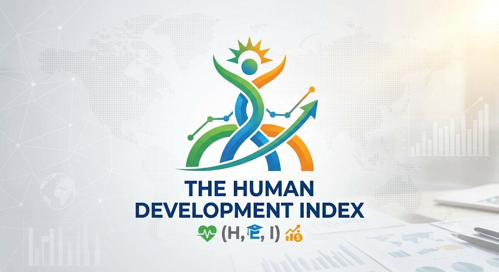

<div align="center">

  

  # 🌌 Human Development Index Predictor

  **A Flask-powered Machine Learning web app that predicts the UN Human Development Index (HDI) from country-level indicators — with a stunning galaxy-themed UI.**

  [](https://python.org)
  [](https://flask.palletsprojects.com)
  [](https://scikit-learn.org)
  [](LICENSE)

</div>

---

## 📖 Overview

The **HDI Predictor** uses a Linear Regression model (R² = **0.9582**) trained on real-world United Nations data to instantly predict a country's Human Development Index score. Enter four simple indicators and get:

- 🎯 **Predicted HDI score** with confidence level
- 📊 **Interactive radar & bar charts** (Chart.js)
- 🏷️ **Development tier classification** (Very High / High / Medium / Low)
- 🌍 **Country auto-fill** from 190+ countries
- 📂 **Batch CSV prediction** via drag-and-drop

---

## ✨ Features

| Feature | Details |
|---|---|
| **Single Prediction** | Life Expectancy, Expected Schooling, Mean Schooling, GNI per Capita |
| **Batch Prediction** | Upload a CSV and predict for multiple countries at once |
| **Country Auto-fill** | Select a country to pre-populate all indicator fields |
| **Visual Results** | Radar chart (component indices), bar chart (feature contribution) |
| **Galaxy UI** | Animated starfield, nebula backgrounds, shooting stars |
| **Responsive** | Works on mobile, tablet, and desktop |

---

## 🗂️ Project Structure

```
ML - 0027 - Human Development Index/
│
├── Flask/                          # ← Web application root
│   ├── app.py                      # Flask app factory & entry point
│   ├── HDI.pkl                     # Trained Linear Regression model
│   │
│   ├── ml/                         # Machine learning module
│   │   ├── __init__.py
│   │   └── predictor.py            # Prediction logic, HDI classification
│   │
│   ├── routes/                     # Flask blueprints
│   │   ├── home.py                 # Home page route
│   │   ├── predict.py              # Prediction API & form handling
│   │   └── about.py                # About page route
│   │
│   ├── templates/                  # Jinja2 HTML templates
│   │   ├── base.html               # Layout shell (nav, footer, stars)
│   │   ├── index.html              # Home / landing page
│   │   ├── predict.html            # Prediction form page
│   │   ├── result.html             # Prediction results page
│   │   └── about.html              # About / tech stack page
│   │
│   └── static/
│       ├── css/style.css           # Galaxy theme stylesheet
│       ├── js/
│       │   ├── predict.js          # Form logic, country auto-fill, CSV
│       │   ├── charts.js           # Chart.js chart rendering
│       │   └── result.js           # Results page animations
│       ├── data/hdi_template.csv   # CSV upload template
│       └── hdi_logo.png            # HDI brand logo
│
├── Dataset/                        # Raw HDI datasets (CSV)
├── Training/                       # Model training notebooks / scripts
└── README.md                       # This file
```

---

## ⚙️ Prerequisites

Make sure you have the following installed:

- **Python 3.9 or higher** — [Download](https://python.org/downloads)
- **pip** (comes with Python)
- **Git** — [Download](https://git-scm.com)

---

## 🚀 Quick Start

### 1 · Clone the Repository

```bash
git clone https://github.com/pspvv/HDI.git
cd HDI
```

### 2 · Create a Virtual Environment

```bash
# Windows
python -m venv venv
venv\Scripts\activate

# macOS / Linux
python3 -m venv venv
source venv/bin/activate
```

### 3 · Install Dependencies

```bash
pip install flask scikit-learn pandas numpy
```

> **Tip:** If a `requirements.txt` is present, use `pip install -r requirements.txt` instead.

### 4 · Run the App

```bash
cd Flask
python app.py
```

You should see:

```
============================================================
HDI Predictor Web Application
============================================================

[OK] Model loaded successfully!
[OK] Flask app initialized successfully!
[OK] Starting server at http://localhost:5000

Press Ctrl+C to stop the server
```

### 5 · Open in Browser

```
http://localhost:5000
```

---

## 📦 Creating `requirements.txt`

To generate a `requirements.txt` for others (run inside your activated venv):

```bash
pip freeze > requirements.txt
```

At minimum, the app requires:

```
flask>=3.0
scikit-learn>=1.3
pandas>=2.0
numpy>=1.24
```

---

## 🧠 Model Details

| Property | Value |
|---|---|
| Algorithm | Linear Regression |
| R² Score | **0.9582** |
| MAE | 0.0216 |
| RMSE | 0.0326 |
| MSE | 0.0011 |
| Training Data | UN HDI Dataset (190+ countries) |
| Model File | `Flask/HDI.pkl` |

### Input Features

| Feature | Unit | Typical Range |
|---|---|---|
| Life Expectancy at Birth | Years | 40 – 90 |
| Expected Years of Schooling | Years | 0 – 25 |
| Mean Years of Schooling | Years | 0 – 15 |
| GNI Per Capita (PPP) | USD | 100 – 200,000+ |

### Output Classes

| HDI Score | Classification |
|---|---|
| ≥ 0.800 | 🟢 Very High Development |
| 0.700 – 0.799 | 🔵 High Development |
| 0.550 – 0.699 | 🟡 Medium Development |
| < 0.550 | 🔴 Low Development |

---

## 📋 Batch CSV Prediction

To predict HDI for multiple countries at once:

1. Go to the **Predict** page and scroll to **Batch CSV Prediction**
2. Download the template from: `Flask/static/data/hdi_template.csv`
3. Fill in your data with these exact column names:

```
Country, Life Expectancy, Expected Schooling, Mean Schooling, GNI per Capita
```

4. Drag and drop (or click to upload) your CSV file
5. Results appear in a table you can download

---

## 🛠️ Tech Stack

| Layer | Technology |
|---|---|
| Backend | Flask (Python) |
| Machine Learning | Scikit-learn, Pandas, NumPy |
| Frontend | HTML5, Tailwind CSS (CDN) |
| Charts | Chart.js 4.x |
| Fonts | Plus Jakarta Sans (Google Fonts) |
| Model Storage | Python pickle (`.pkl`) |

---

## 🌐 API Routes

| Route | Method | Description |
|---|---|---|
| `/` | GET | Home / landing page |
| `/predict` | GET | Prediction form |
| `/predict` | POST | Submit indicators → results |
| `/about` | GET | About page & model info |
| `/api/countries` | GET | JSON list of all countries |

---

## 🖼️ UI Theme — Galaxy Mode

The app runs in a permanent **galaxy / deep-space theme**:

- 🌌 Deep space background (`#05040f`) with purple/blue nebula radial clouds
- ⭐ 45+ CSS star points across 3 size layers with a twinkling animation
- 🌠 3 animated shooting stars
- 🌫️ Diagonal Milky Way band overlay
- 🔮 Glassmorphism cards with violet borders & glow on hover
- 💜 Violet accent color (`#a78bfa`) throughout buttons, links, and headings

---

## 🤝 Contributing

1. Fork the repository
2. Create your feature branch: `git checkout -b feature/your-feature`
3. Commit your changes: `git commit -m "Add your feature"`
4. Push to the branch: `git push origin feature/your-feature`
5. Open a Pull Request

---

## 👤 Author

**Sandeep** — [GitHub](https://github.com/pspvv)

---

## 📄 License

This project is licensed under the **MIT License**.

---

<div align="center">
  <sub>Built with 💜 and machine learning</sub>
</div>
